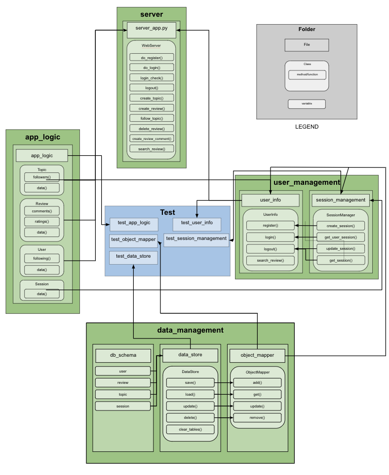
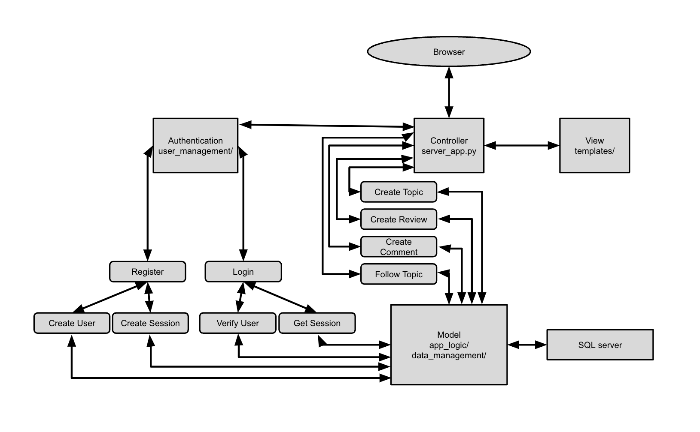
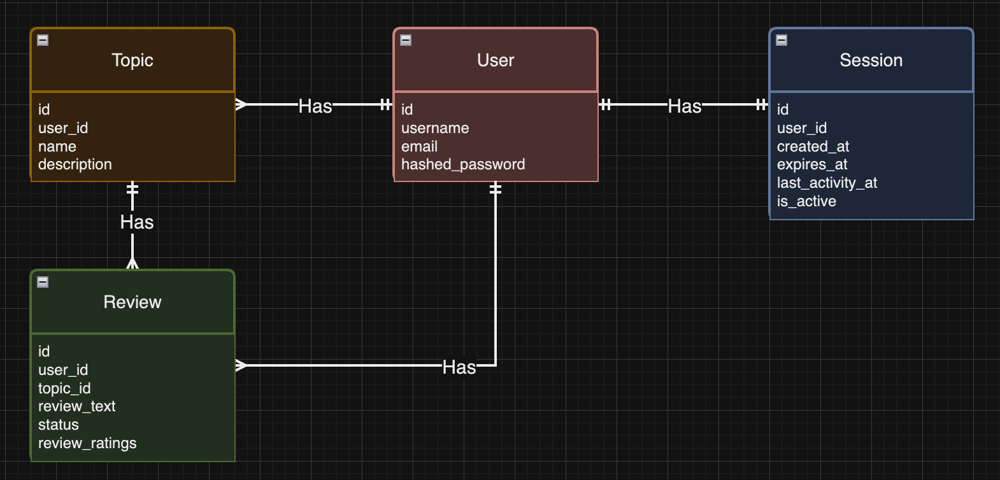
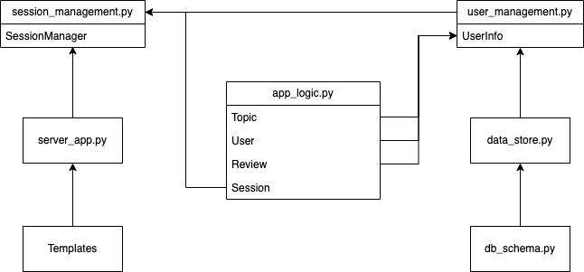

# Team L Project

## How to run:
- First run the following to install dependancies:
```
$ pip install -r requirements.txt
```
- navigate to the root directory `TEAM-PROJECT-TEAML/`
- then run the following command to start the server
```
$ python3 -m src.server.server_app
```
- Once the server is running you will have to register with a name, email, and password. Once registered you will log in and will be redirected to the logged in pages where you can create topics and reviews

- if you have error ModuleNotFoundError: No module named 'bottle' try re0intalling bottle using pip3. It was fixed on one team members computer using "sudo pip3 install bottle" to re-install bottle.

## Running Tests:
- navigate to the root directory `TEAM-PROJECT-TEAML/`
- then run the following command to run a test
```
$ python3 -m unittest test/<test_file_name.py>
```

## Component Architecture Diagram


## Microservices Architecture Diagram


## Database ERD Diagram


## Process Model Analysis Document
Our process model analysis is located under `process_analysis/` [click here](process_analysis)

## Server Diagram


## Individual Contributions

### Performance Reviews
Performance reviews will be found under the `perf_reviews` folder. Each member will add a file with their performance reviews of the rest of the group. Each folder represents a sprint inside perf_reviews, so to see the performance reviews for sprint 3, view the sprint-3 folder. [click here](perf_reviews/)

### Code Reviews
Code reviews will be found under each individual pull request which will have a discussion section where reviews will be shown and any issues that arise. Along with the pull request code reviews, we also have end-of-sprint code reviews located under the `code_reviews` folder, where each team member will have a review of everyone elses code. [click here](code_reviews/)

### Brady:
#### Implementations:
- `src/data_management/db_schema.py`
- `src/data_management/data_store.py`
- `src/data_management/object_mapper.py`
- `src/templates/`

#### Tests:
- `test/test_data_store.py`
- `test/test_object_mapper.py`

### Martha:
#### Implementations:
- `src/app_logic/app_logic.py`

#### Tests:
- `test/test_app_logic.py`

### Mayesha:
#### Implementations:
- `src/user_management/user_info.py`
- `src/user_management/session_management.py`

#### Tests:
- `test/test_user_info.py`
- `test/test_sesssion_management.py`

### Cody:
#### Implementations:
- `src/server/server_app.py`

#### Tests:
- None

### Vansh:
#### Implementations:
- assigned `src/templates/` but no contribution, task given to Brady instead

#### Tests:
- None